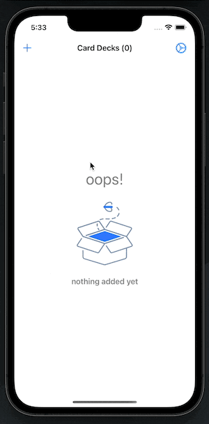

# SimpleDecks
Simple Decks is a simple, easy-to-use flashcard app that allows the user to create a card deck and then add cards to that deck.
This app was created from the idea of having a simple, non-complex way of storing flashcards.

The app includes a wide variety of features for the user...
1. Simple animations for button states as well as the flashcards themselves 
2. An empty state indicating that nothing is saved both in the card decks table view as well as the falshcards collection view 
3. system colors allowing for dark mode compatability 
4. The ability to save a prefered flashcard color

## App demonstration 

### Creating a card deck

